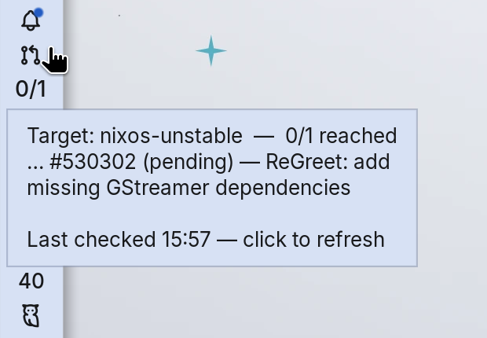

<div align="center">

# Nixpkgs PR Tracker

**A [Noctalia](https://noctalia.dev) v5 plugin that watches nixpkgs pull requests and notifies you the moment each one lands on your target branch.**

[](https://docs.noctalia.dev/v5/plugins/development/)
[](https://nixos.org)
[](LICENSE)
[](https://luau.org)

</div>

---

Tracking whether your nixpkgs PR has reached `nixos-unstable` usually means
refreshing [nixpk.gs](https://nixpk.gs) by hand. This plugin does it for you: it
polls in the background and fires a single desktop notification per PR the instant
it reaches your chosen branch — plus a compact status tile for your bar.

## Features

- 🔔 **Notify-once per PR** when it reaches the target branch (default `nixos-unstable`).
- 🧩 **Bar widget** showing a compact `merged/total` count, a per-PR tooltip, and an icon.
- 🖥️ **Works headless** — notifications fire even when the widget isn't on your bar.
- 🔁 **Manual refresh** on click; configurable poll interval.
- 💾 **No duplicate pings** — the notified set is persisted across reloads and restarts.
- ❄️ **NixOS-friendly** — never writes into its own (possibly read-only) plugin directory.
- 🛟 **Resilient** — network, parse, and not-found/closed-PR errors are logged, never fatal.

## At a glance

<div align="center">



</div>

| Widget shows | Meaning |
|---|---|
| `2/3` + pull-request icon | 2 of 3 tracked PRs have reached the target |
| `3/3` + merge icon | all tracked PRs have landed |
| `—` | no PRs configured yet |
| ⚠ alert icon | one or more PRs hit an error (see tooltip) |

The tooltip lists each PR's status and the last-checked time. **Left-click to refresh now.**

## Installation

### home-manager (flake) — recommended

Add the plugin as a source-only flake input and let home-manager deploy it.

**1.** Add the input to your `flake.nix`:

```nix
inputs.noctalia-nixos-tracker = {
  url = "github:1-bit-wonder/noctalia-nixos-tracker";
  flake = false;
};
```

**2.** In your home-manager configuration, symlink it into Noctalia's plugin
directory (ensure `inputs` is in scope for the module — e.g. via
`extraSpecialArgs = { inherit inputs; }`):

```nix
xdg.dataFile."noctalia/plugins/nixos-tracker".source = inputs.noctalia-nixos-tracker;
```

**3.** If you previously copied the plugin in by hand, remove it so it doesn't
collide with the new symlink, then rebuild:

```sh
rm -rf ~/.local/share/noctalia/plugins/nixos-tracker
nixos-rebuild switch --flake .   # or: home-manager switch --flake .
```

> A read-only Nix store path is fine — the plugin keeps its runtime state in
> `$XDG_STATE_HOME`, never in its own directory.

To update later:

```sh
nix flake update noctalia-nixos-tracker && nixos-rebuild switch --flake .
```

### Manual

```sh
git clone https://github.com/1-bit-wonder/noctalia-nixos-tracker.git \
  "${XDG_DATA_HOME:-$HOME/.local/share}/noctalia/plugins/nixos-tracker"
```

The manifest must end up at
`${XDG_DATA_HOME:-~/.local/share}/noctalia/plugins/nixos-tracker/plugin.toml`.

### Enable it

1. Restart the Noctalia shell (a new `plugin.toml` is picked up on config reload;
   `.luau` edits hot-reload live).
2. **Settings → Plugins** → enable **Nixpkgs PR Tracker**, then open its settings.
3. *(Optional)* add the **Nixpkgs PR Tracker** widget to your bar. Notifications
   work without it.

## Configuration

Configured in Noctalia's UI under **Settings → Plugins → Nixpkgs PR Tracker**.

| Setting | Default | Notes |
|---|---|---|
| **Pull requests** | *(empty)* | Comma-separated. Bare numbers, `#123`, or full GitHub PR URLs all work — e.g. `530302, #528900, https://github.com/NixOS/nixpkgs/pull/527000`. |
| **Target branch** | `nixos-unstable` | e.g. `nixos-unstable`, `nixos-unstable-small`, `nixpkgs-unstable`, `master`, `nixos-25.05`. Must match the branch label nixpk.gs shows. |
| **Poll interval (seconds)** | `600` | Minimum **60s** (enforced in code). Be polite to nixpk.gs. |

### Behaviour

- **Notify-once.** Each notification is keyed by `PR@branch` and persisted to
  `${XDG_STATE_HOME:-~/.local/state}/noctalia/nixos-tracker/notified.json`, so you
  never get a duplicate — even across restarts.
- **Changing the target branch re-arms** notifications for the new branch; old
  history is kept, so switching back won't re-notify.
- **Already-merged when added.** Add a PR that has *already* reached the target and
  you get one notification on the first poll, then never again.

## How it works

The plugin is split into two entries, mirroring the official `screen_recorder` plugin:

| Entry | File | Role |
|---|---|---|
| **Service** | `background.luau` | Headless `[[service]]` that runs for the whole session. Polls, parses, notifies, and publishes a `status` snapshot on the shared state channel. |
| **Widget** | `widget.luau` | Thin bar tile that mirrors `status` and triggers a refresh via the `command` channel. |

Polling lives in the **service** so notifications fire regardless of whether the
widget is placed on the bar.

### Data source

[nixpk.gs](https://nixpk.gs) is Alyssa Ross's
[`pr-tracker`](https://git.qyliss.net/pr-tracker), and it has **no JSON API** —
`GET https://nixpk.gs/pr-tracker.html?pr=<N>` returns fully server-side-rendered
HTML (no client JS, nothing to intercept). The plugin parses the nested branch
tree directly. Each node looks like:

```html
<span class="state-accepted">✅</span>
<a href="https://hydra.nixos.org/...">nixos-unstable</a>
```

States are `accepted` (✔ reached), `pending` (⚪ not yet), `unknown` (?), and
`rejected` (❌ closed unmerged). **A PR has "reached branch X"** when the anchor
with text `X` carries `state-accepted`. Captured fixtures live in
[`samples/`](samples/), which the parser is tested against.

## Development & testing

Verified with `luau` 0.720 against the real nixpk.gs response and the real Noctalia
plugin API (cross-checked against the official `example` and `screen_recorder`
plugins):

- ✅ Both scripts compile (`luau-compile`) and run clean under a mocked host.
- ✅ The HTML parser extracts title, PR state, and every branch state correctly
  from [`samples/pr-530302.html`](samples/pr-530302.html).
- ✅ End-to-end: the real sample fires **exactly one** notification, dedups across
  repeated polls, treats a 404 PR as an error, and publishes the correct
  `merged/total/errors` snapshot.

### Quick manual test

1. Set **Pull requests** = `530302`, **Target branch** = `nixpkgs-unstable` (this
   PR has already reached it), **Poll interval** = `60`.
2. Enable the plugin → within a minute you get one notification
   *"Nixpkgs PR #530302 reached nixpkgs-unstable"*; the widget shows `1/1`.
3. Restart Noctalia → you should **not** be notified again.
4. Inspect the state file to confirm the persisted keys:
   ```sh
   cat ${XDG_STATE_HOME:-~/.local/state}/noctalia/nixos-tracker/notified.json
   ```
5. If anything misbehaves, check Noctalia's logs for `nixos-tracker:` lines.

### Tweaking

- **Icons** (`git-pull-request`, `git-merge`, `alert-triangle`) and **theme
  colors** (`primary`, `error`, `on_surface`, …) are set at the top of
  `widget.luau`. Unknown glyphs are logged and skipped by Noctalia, so a blank
  icon just means a name to swap.

## Credits

- Data from [nixpk.gs / pr-tracker](https://git.qyliss.net/pr-tracker) by
  [Alyssa Ross](https://alyssa.is/).
- Built for [Noctalia](https://noctalia.dev).

## License

[MIT](LICENSE) © 1-bit-wonder
